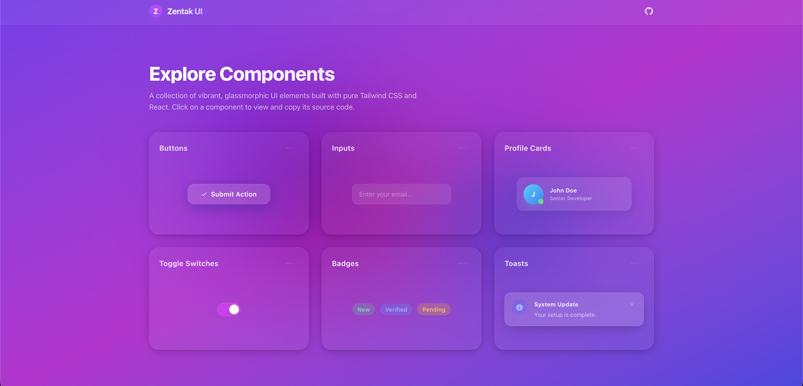

   
  <h1>✨ Zentak Glass UI</h1>
  

    <strong>A modern, stunning, copy-paste glassmorphism component library built with React & Tailwind CSS.</strong>
  

  

    <a href="https://zentak-glass-ui.netlify.app/"><strong>Live Demo</strong></a> · 
    <a href="https://github.com/akilakeshara/zentak-glass-ui"><strong>GitHub Repo</strong></a>
  

   
  
    

## 🌌 The Future of UI Aesthetics
Zentak Glass UI pushes the boundaries of modern frontal aesthetics by providing a beautiful, pure glassmorphism design system. 

Say goodbye to complex npm packages and rigid component APIs. **Zentak** is an open-source, beautifully crafted collection of UI components that you simply **copy and paste** directly into your React + Tailwind codebase. Total ownership, ultimate customizability, and jaw-dropping visual fidelity.

---

## 🚀 Features

- 💧 **Unmatched Glassmorphism:** Deep, semi-transparent layers, powerful backdrop-blurs, subtle white borders, and immersive drop shadows out of the box.
- 🎨 **Pure Tailwind CSS:** Zero new dependencies or messy CSS files. Everything is styled entirely with standard, highly-readable Tailwind utility classes.
- ⚡ **Copy-Paste Ready:** No `npm install zentak-ui`. Just browse the live gallery, preview the components, click copy, and paste the raw React code right into your project.
- 📱 **Fully Responsive:** All layout and component structural grids are flawlessly responsive to shine on desktop, tablet, and mobile displays.
- 🎨 **Theme-agnostic Base:** Neutral glass tones map beautifully over any vibrant background, image, or gradient you place behind it.

---

## 🛠️ Quick Start / How to Use

Zentak UI is designed to be frictionless.

1. **Browse** – Visit the [Live Demo](https://zentak-glass-ui.netlify.app/).
2. **Preview** – Explore the components grid. Click any component card to open the **Code Viewer Modal**.
3. **Copy Code** – Review the live interactive preview on the left, and hit the **"Copy Code"** button on the right to grab the raw React JSX string.
4. **Paste & Go!** – Paste the component anywhere in your Tailwind-enabled React project. Customize freely!

---

## 📦 Components Included

The current stable release of Zentak UI includes meticulously crafted glass-variants for standard UI primitives:

- **Buttons:** Dynamic scale-up on hover with active press-states and inner shimmer effects.
- **Inputs:** Semi-transparent form fields with beautiful fuchsia-tinted focus rings.
- **Profile Cards:** Avatar display cards with skeleton layouts and soft background glares.
- **Toggles:** Completely CSS-driven, smooth animated switches.
- **Badges:** Colored status indicators (New, Verified, Pending) with subtle tinted glowing blurs.
- **Toasts:** Non-intrusive notification popups rigged with slide-in animations.

---

## 🤝 Contributing

Zentak Glass UI is open source! Feel free to fork the repository, build your own jaw-dropping glassmorphic components, and submit a Pull Request.

1. Fork the Project
2. Create your Feature Branch (`git checkout -b feature/AmazingComponent`)
3. Commit your Changes (`git commit -m 'Add some AmazingComponent'`)
4. Push to the Branch (`git push origin feature/AmazingComponent`)
5. Open a Pull Request

---

## 📄 License

Distributed under the MIT License. See `LICENSE` for more information.

---

  
Built with ❤️ using React and Tailwind CSS v4

